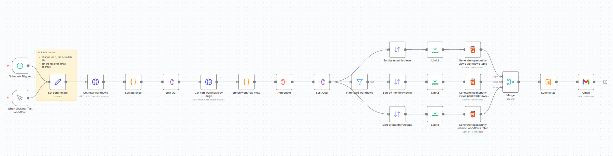
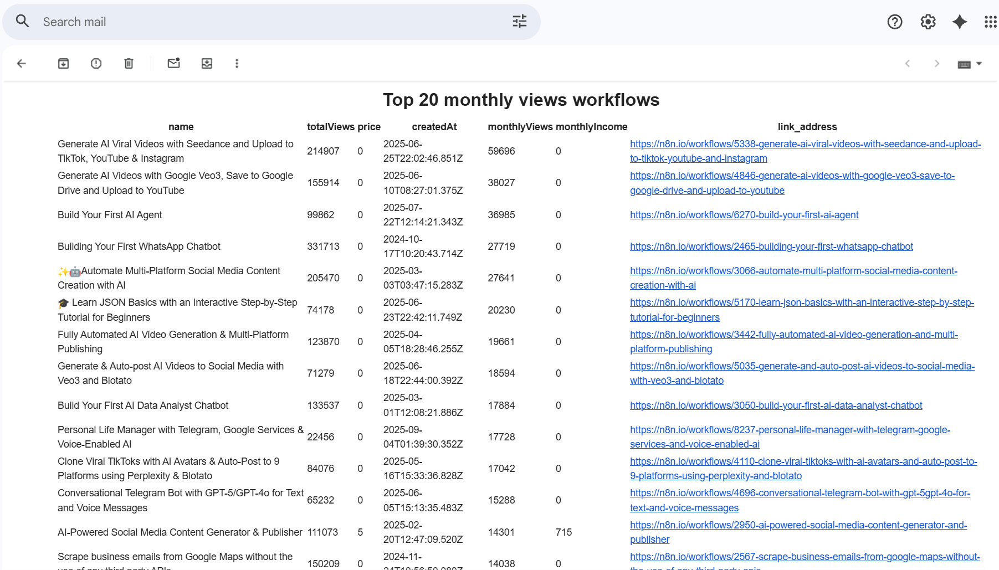

# N8n Workflows Trending

Automatically discover the most popular workflows on the [n8n.io](https://n8n.io) marketplace. This n8n workflow fetches public data, calculates ranking metrics, and delivers a formatted report straight to your inbox via Gmail.

## Features

- **Top 20 by monthly average views** — see what the community is clicking on most
- **Top 20 paid workflows by monthly average views** — track the best-selling templates
- **Top 20 by estimated monthly income** — find the most profitable automation ideas
- Configurable limit — change `20` to any number inside the n8n node to get more results
- Sends a neatly formatted HTML email report via Gmail

## Workflow Preview

## Email Report Preview

## How It Works

1. Fetches all published workflows from the n8n.io public API
2. Calculates daily/monthly average views and estimated income
3. Ranks workflows across three categories
4. Builds an HTML table and sends the report via Gmail

## Import & Setup

### Prerequisites

- An [n8n](https://n8n.io) instance (self-hosted or n8n Cloud)
- A Gmail account (for sending reports)

### Step 1 — Import the workflow

1. Open your n8n dashboard
2. Click the **⋮** menu (top right) → **Import from File…**
3. Select [`main.json`](main.json) from this repository
4. The workflow will appear in your editor

### Step 2 — Configure Gmail credentials

1. Open the **Gmail** node in the workflow
2. Click **Credential for Gmail** → **Create New**
3. Sign in with your Google account and grant n8n the required permissions

### Step 3 — Set parameters

1. Open the **Set parameters** node
2. Update the following fields:
   - **receiver email** — the email address that will receive the trending report
3. *(Optional)* Adjust the limit in the sort/filter nodes (default is `20`)

### Step 4 — Run

- Click **Test workflow** to run it immediately
- Or set up a schedule trigger to receive reports automatically (e.g., weekly)

## Use Cases

- **Automation creators** — research which workflows are profitable before building your next one
- **n8n marketplace sellers** — track competitors and spot trends
- **Teams using n8n** — benchmark your templates against the community's best
- **Data enthusiasts** — explore open marketplace data with zero setup

## License

[MIT](LICENSE)
